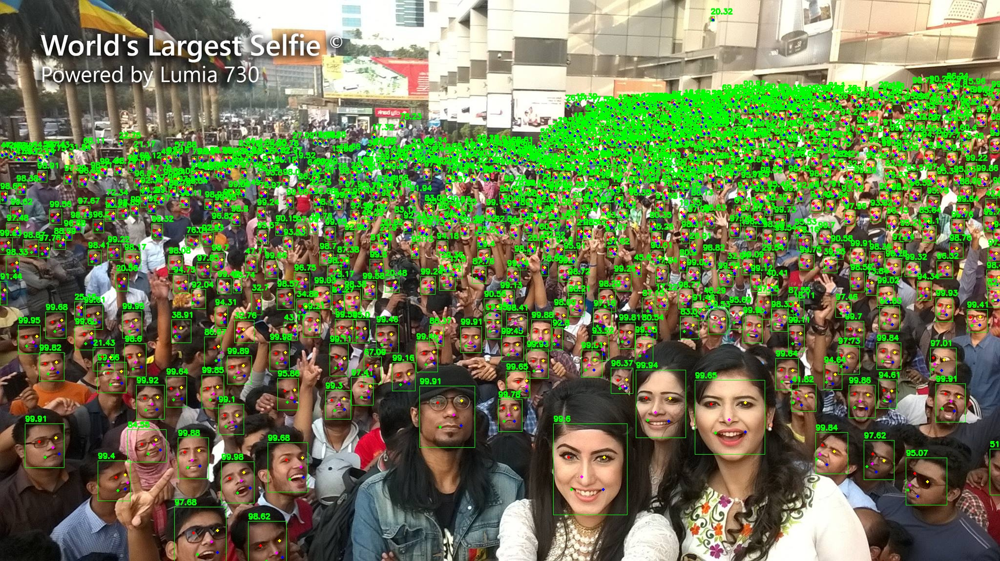

# darknet_face_with_landmark
### 借鉴 [darknet](https://github.com/AlexeyAB/darknet) 做适量修改，用于人脸检测以及关键点检测

## Installation
##### Clone and install
1. git clone https://github.com/ouyanghuiyu/darknet_face_with_landmark.git
2. 使用scripts/retinaface2yololandmark.py脚本将retinaface的标记文件转为yolo的格式使用
3. 其他编译训练都和原版darknet相同
4. 使用yolo_landmark.py进行测试，更换里面的模型配置文件即可

## 精度
### Widerface测试

 - 在wider face val精度（单尺度输入分辨率：**320*240**）
 
 方法|Easy|Medium|Hard
------|--------|----------|--------
libfacedetection v1（caffe）|0.65 |0.5       |0.233
libfacedetection v2（caffe）|0.714 |0.585       |0.306
Retinaface-Mobilenet-0.25(Mxnet)  |0.745|0.553|0.232
mbv2_yolov3_face(our)  |**0.84**|**0.79**|**0.41**
- 在wider face val精度（单尺度输入分辨率：**640*480**） 

方法|Easy|Medium|Hard 
------|--------|----------|--------
libfacedetection v1（caffe）|0.741 |0.683       |0.421
libfacedetection v2（caffe）|0.773 |0.718       |0.485
Retinaface-Mobilenet-0.25(Mxnet)  |**0.879**|0.807|0.481
mbv2_yolov3_face(our)  |0.866|**0.848**|**0.718**

ps: 测试的时候,长边为320 或者 640 ,图像等比例缩放,yolo未作缩放.

## 测试

## References
- [darknet](https://github.com/AlexeyAB/darknet)
